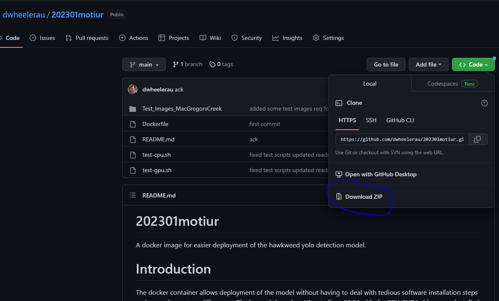
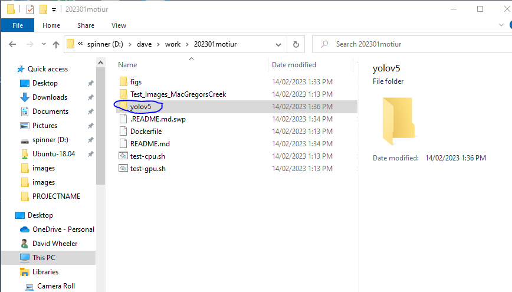
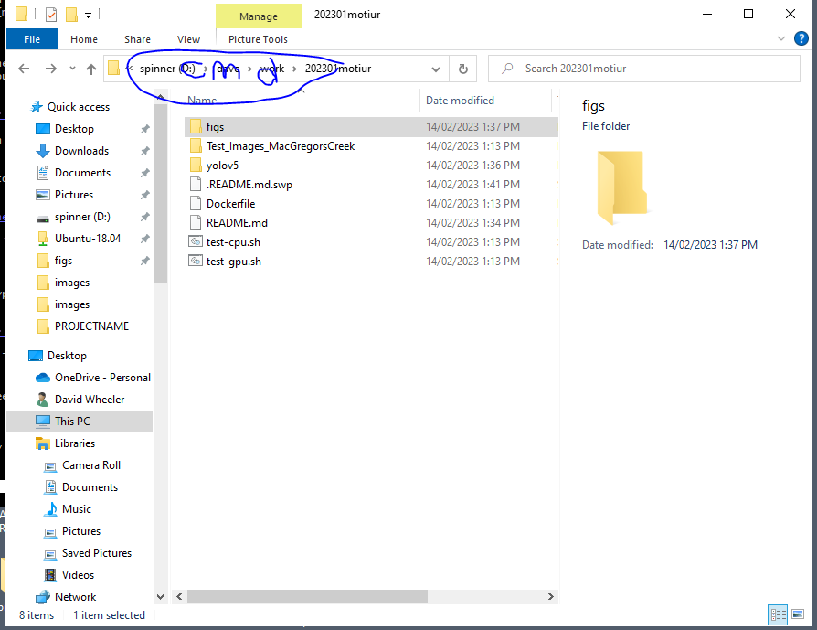
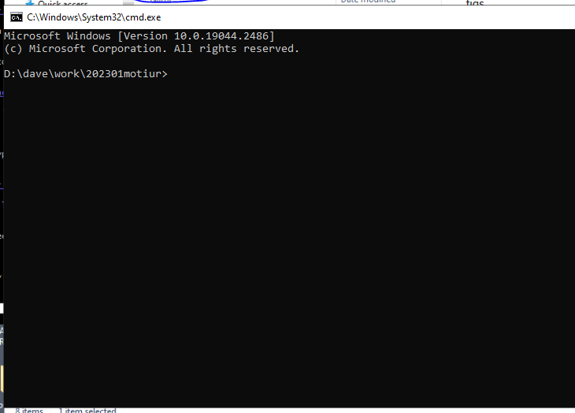
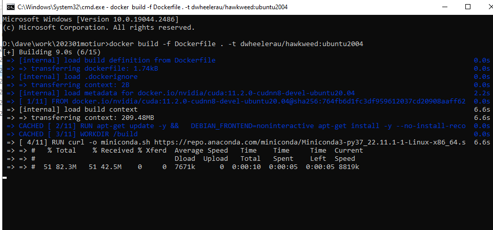
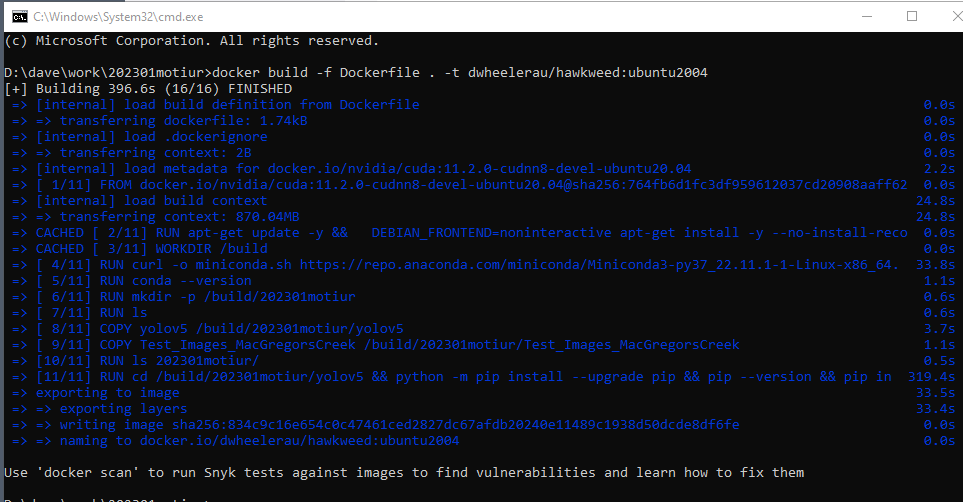
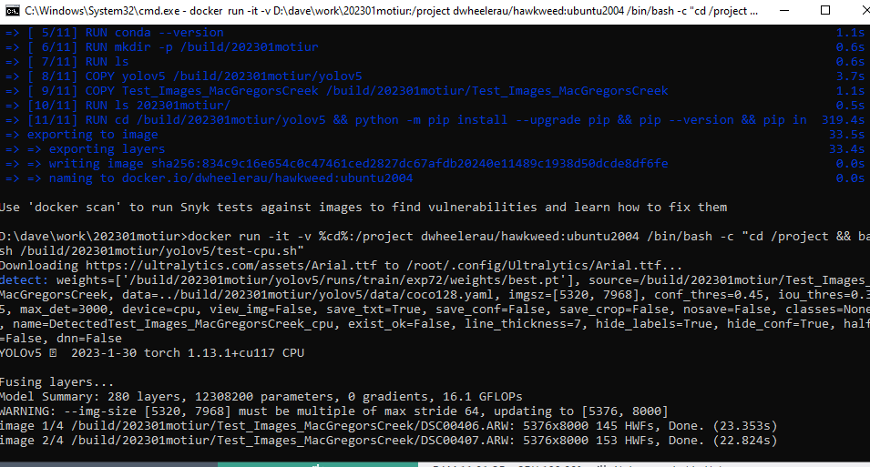
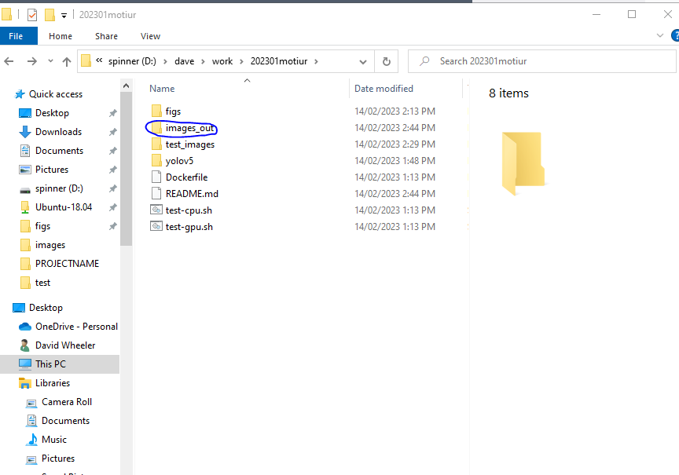

# 202301motiur  
A docker image for easier deployment of the hawkweed yolo detection model.   

# TOC  
- [202301motiur](#202301motiur)
- [Introduction](#introduction)
- [Getting a copy of this repo to your computer](#getting-a-copy-of-this-repo-to-your-computer)
- [Build the container.](#build-the-container)
- [Quickstart](#quickstart)
  * [CPU test script](#cpu-test-script)
  * [GPU test script (optional)](#gpu-test-script--optional-)
- [Using the python script directly for image inference](#using-the-python-script-directly-for-image-inference)
  * [Running inference using the python script on your own images](#running-inference-using-the-python-script-on-your-own-images)
  * [Running the container interactively](#running-the-container-interactively)
- [Acknowledgements](#acknowledgements)

# Introduction  
The docker container allows deployment of the model without having to deal with tedious software installation steps and operating system differences. The image is based on Ubuntu linux 20.04 with the GPU CUDA drivers pre-installed. The high resolution data processed by this model require GPU with a reasonably large amount of RAM (>8GB), however, the detections can be carried out in CPU mode (~12 seconds per image).  

The `detect.py` script that runs the model inference can be run using the `docker run` command or interactively by logging into the docker container itself after it is started in `-d` (detected mode). Instructions for both modes of interaction are shown below.  

The following steps are written for windows users, see the Linux branch if you use that system. I've written a somewhat user-friendly [guide](https://github.com/dwheelerau/docker-guide) to installing docker on windows. This guide includes an example running a camera trap detection model (megadetector) which you might want to try first if you are new to all of this.  

# Getting a copy of this repo to your computer  
click on the `code` button on the main page of the repo (see below) and download
the zip file to your desktop (or a location of your choice) and unzip the folder. 



Note these steps will take some time depending on the speed of your internet connection.  

Copy the yolov5 directory (request from Motiur) to this directory, it should look like this

  

Then copy the two test scripts `test-cpu.sh` and `test-gpu.sh` into the yolov5 directory.  

# Build the container.   
Open a command prompt in the repo directory by typing `cmd` in the browser window (circled below).  

  

This should open a command line prompt in the current directory.  

  

Type (or copy/paste) the following command to build the container.  

```
docker build -f Dockerfile . -t dwheelerau/hawkweed:ubuntu2004
```
Docker will start to download the entire internet (so this may take some time)!  
  

If everything goes well you should see "FINISHED" printed to screen.  

  

# Quickstart
The following should mount your current directory and save the test results to it.

## CPU test script   
```
docker run -it -v %cd%:/project dwheelerau/hawkweed:ubuntu2004 /bin/bash -c "cd /project && bash /build/202301motiur/yolov5/test-cpu.sh"
```  
If everything works the following should print to screen.  

  

## GPU test script (optional)   
You will need a reasonably large RAM GPU.  
```
docker run --gpus all -it -v %cd%:/project dwheelerau/hawkweed:ubuntu2004 /bin/bash -c "cd /project && bash /build/202301motiur/yolov5/test-gpu.sh"
```

# Using the python script directly for image inference  
The following provides several ways of using the model for hawk weed inference.  
## Running inference using the python script on your own images
This assumes you have your images in a folder called `images` located in your current working directory.    

Start the container in detached mode `-d` after mounting your cwd.  

```
# -it is interactive tty
# -d detached so keep running after command is executed
docker run -it -d -v %cd%:/project dwheelerau/hawkweed:ubuntu2004
```

See what it is called.   
```
docker ps -a
CONTAINER ID   IMAGE                            COMMAND       CREATED         STATUS         PORTS     NAMES
04f40d0ae645   dwheelerau/hawkweed:ubuntu2004   "/bin/bash"   7 seconds ago   Up 6 seconds             dazzling_moser
```

We can see the container is called `dazzling_moser` (this will be different for you). Take note of this name as we use it in the command below.   

Execute a command on the running container (the `projects` directory will already be mounted in your cwd). Change the `--source` location if your images
are stored somewhere other than a folder called `images`. It will save
the detections to a new folder called `images_out`.  

```
# change the name based on the above output from `ps -a`
# if GPU available: --gpus all
# if GPU available: --device gpu
docker exec -it dazzling_moser /bin/bash -c "cd /project && python /build/202301motiur/yolov5/detect.py --device cpu --weights /build/202301motiur/yolov5/runs/train/exp72/weights/best.pt --img 5320 7968 --conf 0.45 --iou 0.35 --source images --name images_out --project /project/"
```
A new folder is created called `images_out` with the results.  

  

## Running the container interactively  
Start the container in detached mode after mounting your cwd.  

```
# -it is interactive tty
# -d detached so keep running after command is executed
 docker run -it -d -v `pwd`:/project dwheelerau/hawkweed:ubuntu2004
```
See what it is called (see last column of the `NAMES` column at the far left of the printout below.  

```
docker ps -a
##CONTAINER ID   IMAGE                            COMMAND       CREATED         STATUS         PORTS     NAMES
##2414a542a929   dwheelerau/hawkweed:ubuntu2004   "/bin/bash"   4 seconds ago   Up 3 seconds             determined_haibt
```

Now you can log in. To see the full list of command line options use `-h`.  

```
docker exec -it determined_haibt /bin/bash

python ./202301motiur/yolov5/detect.py -h

usage: detect.py [-h] [--weights WEIGHTS [WEIGHTS ...]] [--source SOURCE]
                 [--data DATA] [--imgsz IMGSZ [IMGSZ ...]]
                 [--conf-thres CONF_THRES] [--iou-thres IOU_THRES]
                 [--max-det MAX_DET] [--device DEVICE] [--view-img]
                 [--save-txt] [--save-conf] [--save-crop] [--nosave]
                 [--classes CLASSES [CLASSES ...]] [--agnostic-nms]
                 [--augment] [--visualize] [--update] [--project PROJECT]
                 [--name NAME] [--exist-ok] [--line-thickness LINE_THICKNESS]
                 [--hide-labels] [--hide-conf] [--half] [--dnn]

optional arguments:
  -h, --help            show this help message and exit
  --weights WEIGHTS [WEIGHTS ...]
                        model path(s)
  --source SOURCE       file/dir/URL/glob, 0 for webcam
  --data DATA           (optional) dataset.yaml path
  --imgsz IMGSZ [IMGSZ ...], --img IMGSZ [IMGSZ ...], --img-size IMGSZ [IMGSZ ...]
                        inference size h,w
  --conf-thres CONF_THRES
                        confidence threshold
  --iou-thres IOU_THRES
                        NMS IoU threshold
  --max-det MAX_DET     maximum detections per image
  --device DEVICE       cuda device, i.e. 0 or 0,1,2,3 or cpu
  --view-img            show results
  --save-txt            save results to *.txt
  --save-conf           save confidences in --save-txt labels
  --save-crop           save cropped prediction boxes
  --nosave              do not save images/videos
  --classes CLASSES [CLASSES ...]
                        filter by class: --classes 0, or --classes 0 2 3
  --agnostic-nms        class-agnostic NMS
  --augment             augmented inference
  --visualize           visualize features
  --update              update all models
  --project PROJECT     save results to project/detect,name
  --name NAME           save results to project/name
  --exist-ok            existing project/name ok, do not increment
  --line-thickness LINE_THICKNESS
                        bounding box thickness (pixels)
  --hide-labels         hide labels
  --hide-conf           hide confidences
  --half                use FP16 half-precision inference
  --dnn                 use OpenCV DNN for ONNX inference
```

You should be able to interact with this container via the command line and /build/ is mounted in your cwd on the host.  

# Acknowledgements  
Motiur - model development  
Nico - docker insights
